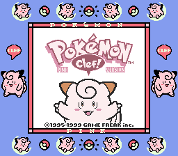
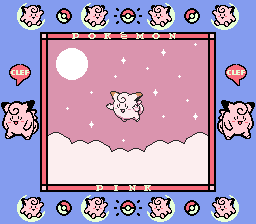
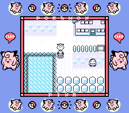
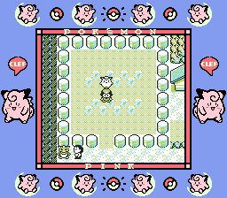
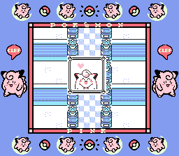
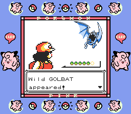

# Pokémon Pink: Special Clefairy Edition

A rom hack that imagines what Pokemon Pink could have been.
Even if progress was made from the original project, this is also not 100% completed, but with enough steps done to make it playable from start to end.
This hack so far changes graphics and sounds, expands the map and adds gender selection, no further improvements were done to keep a "vanilla experience".

It builds the following ROMs:

- pokepink.gbc
- pokepink_debug.gbc
- Dmgapse0.h08.patch

To set up the repository, see [**INSTALL.md**](INSTALL.md).
Keep in mind that this is an already old version of Pokeyellow.

Features:

- Clefairy fully replaces Pikachu.
- Gender selection added.
- Mt. Moon Square from Gen 2 is now added as a counterpart of Surf House. Clefairy shows up at Mt. Moon Square at random.

To do:

- Small changes on intro graphics. (Animated stars, corrections on Clefairy's ears palettes, animate closer Clefairy, SGB palette fixes)
- Add Clefairy jumping animation and cries in Mt. Moon Square.
- Add 41 different sounds for Clefairy.
- Change diploma's art.
- New Clefairy Minigame?

# Screenshots

# Credits

Original project (2020):
- **Mathias** - title screen graphics / Clefairy overworld sprite
- **DarkSideHunterX** - code modifications
- **DarkShade** - Clefairy's emotes

https://github.com/DarkSideHunterX/pokepink

New project (2024):
- **TotalTS** - code modifications / some intro and female protagonist graphics
- **Picto** - Clefairy's intro graphics / SGB Border
- **FrenchOrange** - Clefairy's kick intro graphics
- **Cram-o-dev** - help with inserting Clefairy's sounds
- **PokefanMarcel** - original code of Mt. Moon Square
- **Engezerstorung** - helping me understanding oam_intro.asm
- **Vortiene** - help with optimization on home bank
- **ElectricLeafy** - help with new PalPackets

## See also

- **Discord:** [pret][discord]
- **IRC:** [libera#pret][irc]

Other disassembly projects:

- [**Pokémon Red/Blue**][pokered]
- [**Pokémon Yellow**][pokeyellow]
- [**Pokémon Gold/Silver**][pokegold]
- [**Pokémon Crystal**][pokecrystal]
- [**Pokémon Pinball**][pokepinball]
- [**Pokémon TCG**][poketcg]
- [**Pokémon Ruby**][pokeruby]
- [**Pokémon FireRed**][pokefirered]
- [**Pokémon Emerald**][pokeemerald]

[pokered]: https://github.com/pret/pokered
[pokeyellow]: https://github.com/pret/pokeyellow
[pokegold]: https://github.com/pret/pokegold
[pokecrystal]: https://github.com/pret/pokecrystal
[pokepinball]: https://github.com/pret/pokepinball
[poketcg]: https://github.com/pret/poketcg
[pokeruby]: https://github.com/pret/pokeruby
[pokefirered]: https://github.com/pret/pokefirered
[pokeemerald]: https://github.com/pret/pokeemerald
[discord]: https://discord.gg/d5dubZ3
[irc]: https://web.libera.chat/?#pret
[ci]: https://github.com/pret/pokeyellow/actions
[ci-badge]: https://github.com/pret/pokeyellow/actions/workflows/main.yml/badge.svg
